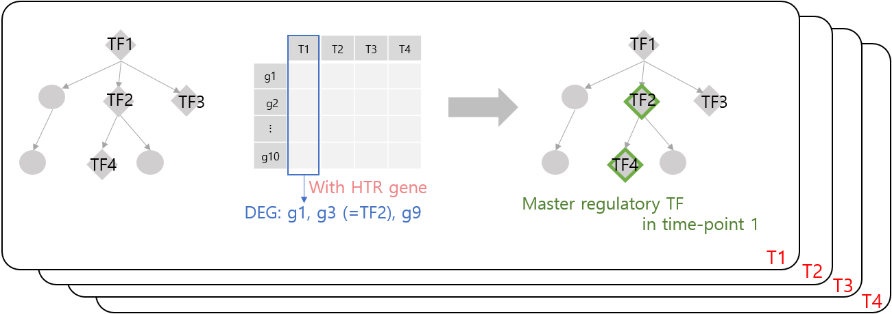

# PropaNet
Propanet discovers the dynamics of TF networks against external stress such as heat stress or cold stress.  
Given time-series **gene expression profile data** and **template network**, Propanet retrieves **master regulatory TFs** in each time-point.



## Installation
To download all the examples, simply clone this repository with the following command:
> `git clone https://github.com/bhi-kimlab/Propanet.git`

## Dependency
To run them, you will need the following dependencies

#### Python : scipy.stats, networkx, multiprocessing, etc.
Python needs to be installed. In addition, a number of libraries are used for the analysis.  
Some of the non-default packages include scipy.stats, networkx and multiprocssing.

#### R : Limma ( _Optional_ )
We use a package called "Limma" which is provided by [Bioconductor](http://bioconductor.org/packages/release/bioc/html/limma.html) to extract DEG data.  
However, the complete datasets that we used in our analysis are provided in the repository.

## Input File Format
There are two types of input files, **gene expression profile data** and **template network**.  
Each data should take the following format:
#### Gene expression profile data
Time-series gene expression data of multiple conditions has to be stored in a single tab-delimited matrix form. (where different conditions are stacked column-wise)  
There should be a header as the first row and it should take the following format:  
> <_GeneID_>  <_Control-time_> <_Condition-time_>

| Gene_id | Control-Shoots-0h | Control-Shoots-1h |  Heat-Shoots-0h  |  Heat-Shoots-1h  |
| ------- | :---------------: | :---------------: | :--------------: | :--------------: |
| Gene1   | expression level  | expression level  | expression level | expression level |
| Gene2   | expression level  | expression level  | expression level | expression level |
| Gene3   | expression level  | expression level  | expression level | expression level |
| ...     | ...               | ...               | ...              | ...              |

###### Example)
```
AGI Control_0_h Control_05_h    Control_1_h Control_3_h Control_6_h Control_12_h    Control_24_h    Cold_0_h    Cold_05_h   Cold_1_h    Cold_3_h    Cold_6_h    Cold_12_h   Cold_24_h
AT1G01010   0   -0.139394407    -0.152530099    -0.156121134    -0.180087384    -0.095033671    -0.216560433    0   -0.154829544    -0.070773114    -0.146864574    -0.142279603    -0.160496473    -0.110211809
AT1G01040   0   -0.042997223    0.059865445 -0.030210557    -0.07748179 -0.045007578    0.021080998 0   -0.045927327    -0.020536712    0.015591588 0.064597276 0.067403396 0.136353683
AT1G01060   0   -0.05952888 -0.083900109    -0.417545241    -0.723319018    -0.691957548    -0.01210007 0   -0.042703729    -0.000666969    -0.02564026 -0.034619052    -0.074636705    -0.075214348
AT1G01070   0   -0.016709256    -0.071140518    -0.010718778    -0.295093989    -0.283263794    -0.049080058    0   0.016980682 -0.036470699    -0.05335869 -0.137604399    -0.212629356    -0.245722342
AT1G01080   0   -0.008805295    0.005914988 0.014547664 0.027181841 0.081628037 0.020220747 0   0.035903529 -0.009913287    -0.0011389  -0.009907133    -0.049022001    -0.084337305
```

#### Template network
The template network file should be comprised of 2 columns : One for source nodes and one for target nodes.  
There should be _no header_ in the first row.

| Source gene  | Target gene  |
| :----------- | :----------- |
| Source gene1 | Target gene1 |
| Source gene2 | Target gene2 |
| Source gene2 | Target gene2 |
| ...          | ...          |

###### Example)
```
AT1G01060	AT1G01470
AT1G01060	AT1G01500
AT1G01060	AT1G06460
AT1G01060	AT1G06470
AT1G01060	AT1G10200
AT1G01060	AT1G10350
AT1G01060	AT1G13590
AT1G01060	AT1G16840
AT1G01060	AT1G19630
AT1G01060	AT1G20030
...
```

---
## Run Propanet
To run Propanet with our example data, simply run the `run.sh` script in command line.
```bash
bash run.sh
```
In order to run Propanet with another dataset,
1. Prepare the data in the format that is described above.
2. run `network_weight.py` and `TF_adding_NP.py` in that order. The arguments for each of the scripts are as follows:
  > `python network_weight.py ` <_template network_> <_gene expression profile data_> <_name of the output template network_>

  > `python TF_adding_NP_noCtrl.py` <_Total TF list_> <*output of network_weight.py*> <_gene expression data_> <_binary file that indicates DEG in the gene expression data_> **-cond** <_prefix of output files_> -outD <_output directory name_>

#### Example)
```bash
python network_weight.py -nwk data/templateNetwork -exp data/DEG.AtGenExpress.signed_zstats.heat_shoots -p 15 -o data/templateNetwork.heat_shoots
python TF_adding_NP_noCtrl.py data/Ath_TF_list.gene data/templateNetwork.heat_shoots data/DEG.AtGenExpress.signed_zstats.heat_shoots data/DEG.AtGenExpress.signed_binary.heat_shoots -cond AtGenExpress.heat_shoots -p 5 -c 0.5 -coverNo 300 -outD result
```
